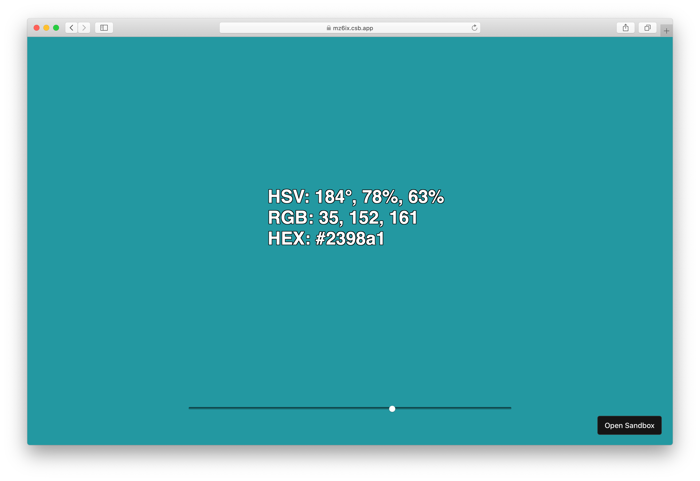

# 1d-color-picker


## Description

This repo is the week2 assignment of the "Hand Held: Creative Tools for Phones" course at ITP.

The assignment is to build a CSS slider toy that responds to user input and demonstrates the style through interaction. I picked the `background-color` among the suggested CSS properties.

My goal was to create a simple one-dimensional color picker that shows a color in HSV, RGB, and HEX format.  
The input slider ranges from 0 to 4294967295 which is a 32-bit unsigned integer which is the maximum safe integer to use the bitwise and shift operators.
The number is then decoded into 10-bit, 10-bit, and 12-bit numbers to control the HSV (Hue, Saturation, Value) color model which is then coverted to RGB and HEX color code to display their values.

Although it makes more sense to use multiple sliders to compose a color, I think it could be useful to quickly skim a wide range of colors to find a color you like. The higher the slider value, the brighter color you will have.

Here's the [Live Demo on CodeSandbox](https://mz6ix.csb.app/).

## Setup

1. Install Node.js with NVM
```
curl -o- https://raw.githubusercontent.com/nvm-sh/nvm/v0.35.3/install.sh | bash
```
2. Run the following commands in the Terminal
```
git clone https://github.com/cuinjune/1d-color-picker.git
cd 1d-color-picker
npm install dependencies
npm start
```
3. Open your web browser and navigate to http://localhost:1234
